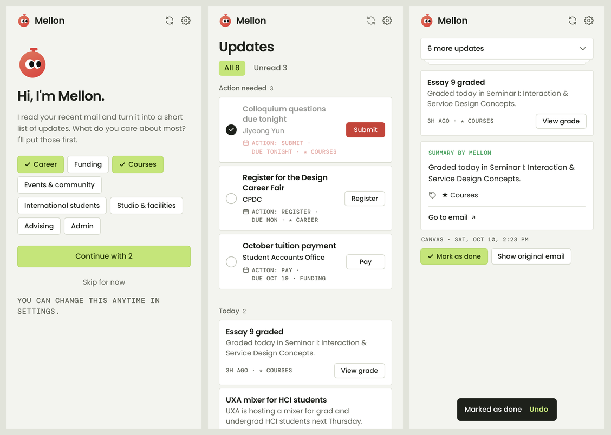

# Mellon

Mellon is a Chrome extension that opens as a side panel next to Gmail. It reads your recent email and turns it into a short, ranked list of **Updates**, so you can see what needs doing first.



*Screens shown with sample mail.*

## What it does

- Reads your inbox from the **last 7 days, up to 30 emails** (read-only).
- For each email, Claude writes:
  - a short title and a one-line summary
  - the action, if any (Submit, Pay, Register, RSVP…), and whether it is required
  - the deadline
  - a category: Career, Funding, Courses, Events & community, International students, Studio & facilities, Advising, or Admin
- Ranks the results:
  - **Action needed**: emails with a required action, soonest deadline first.
  - **Today / Earlier this week**: everything else. Your interests come first, then the newest.
  - Words the sender adds, like "IMPORTANT" or "URGENT", never change the order.
- Each card shows the title, sender, deadline and an action button. Deadlines within 24 hours are red. A line under each card explains its place, e.g. `Action: Submit · due tonight · ★ Career`.
- Tap a card to see the summary, key details, and the original email.
- Mark an update as done and it moves to **Done**. You can undo this.
- **Select** several updates and **Discard** them from Mellon (the Gmail messages are not touched). This works with Undo.
- **Calendar**: shows a dot on each date with a deadline. Tap a date to see what is due.
- **English or Korean (한국어)**: the language switch also translates Mellon's titles and summaries. You can read any original email translated into Korean.
- On first run, you pick a language and the categories you care about.

## Privacy and cost

- **Gmail access is read-only** (`gmail.readonly`). Mellon cannot send, delete, or change mail.
- **Your email stays on your computer.** The only place it goes is the Claude API, to be summarized. Results are saved in Chrome's local storage on your computer, and there is no Mellon server.
- **Your Claude API key is entered in Mellon's Settings** and saved only in Chrome on your computer. It is never in the code or on GitHub.
- **It uses Claude Haiku 5.5**, the lowest-cost model. Each email is sent once, and its result is saved and reused. A full refresh of 30 new emails usually costs a few cents.
- The Google sign-in token is kept in memory only, so it is gone when Chrome closes.
- In Korean, only Mellon's short notes (title, summary, action, key details) are sent to Claude for translation, once per email. A translated original email is shown on screen only and never saved.

## What you need

- Google Chrome on a computer
- A Google account with Gmail
- A Claude API key from [console.anthropic.com](https://console.anthropic.com) (needs a few dollars of credit)
- A Google OAuth client ID. See step 2: either the Mellon owner gives you one, or you make your own.

## Install

### 1. Get the files and load them into Chrome

1. Download this repository from GitHub (green **Code** button → **Download ZIP**) and unzip it.
   - Or clone it: `git clone https://github.com/islachae/portfolio2026.git`
2. In Chrome, go to `chrome://extensions`.
3. Turn on **Developer mode** (top right).
4. Click **Load unpacked** and choose the **`mellon-extension`** folder. Pick that folder itself, not the folder above it.
5. Mellon should appear with the ID **`ffikmckjbkldjdfbbajhiohdlefnejmc`**. The ID is the same on every computer because it is fixed by the `key` in `manifest.json`.
6. Pin it: click the puzzle icon 🧩 in the toolbar, then the pin next to Mellon.

### 2. Google sign-in (OAuth client ID)

Mellon is in **testing mode** on Google Cloud. Only Google accounts listed as **test users** can sign in, up to 100 of them. There are two ways to get set up.

**Option A: the owner adds you (easiest).** Send the owner the email address you use for Gmail. They add it under **Test users** (see A5 below) and send you the **client ID**. Then skip to step 3.

**Option B: make your own Google Cloud project.** This takes about 10 minutes. Use the Google account whose mail you want to read.

1. Go to [console.cloud.google.com](https://console.cloud.google.com). Open the project menu at the top → **New project** → name it `Mellon` → **Create**. Make sure the new project is selected.
2. Search for **Gmail API** in the top search bar → **Enable**.
3. Go to **APIs & Services → OAuth consent screen** (it may be called "Google Auth Platform") → **Get started**.
   - App name: `Mellon`
   - Support email: your email
   - Audience: **External**
   - Contact email: your email
   - Agree, then **Create**.
4. **Data Access** → **Add or remove scopes** → find `.../auth/gmail.readonly` and check it. If it is not in the list, paste `https://www.googleapis.com/auth/gmail.readonly` under "Manually add scopes". Then **Update** → **Save**.
5. **Audience**: leave Publishing status on **Testing**. Under **Test users** → **+ Add users**, add your email (and anyone else who will use your client ID) → **Save**.
6. **Clients** → **+ Create client**:
   - Application type: **Web application**
   - Name: `Mellon extension`
   - **Authorized redirect URIs** → **+ Add URI** → paste this exactly, including the last `/`:
     ```
     https://ffikmckjbkldjdfbbajhiohdlefnejmc.chromiumapp.org/
     ```
   - Click **Create**, then copy the **Client ID** (it ends in `.apps.googleusercontent.com`). You don't need the client secret, so don't paste it anywhere.

### 3. Claude API key

1. Sign in at [console.anthropic.com](https://console.anthropic.com) and add credit under **Billing** if needed.
2. Go to **API Keys** → **Create Key**. If you are asked about identity federation, choose **Continue with an API key**.
3. Copy the key (`sk-ant-...`). It is shown only once. Keep it private and paste it only into Mellon's Settings.

### 4. First run

1. Open Gmail, then click the Mellon icon. The side panel opens.
2. Pick the categories you care about → **Continue**.
3. Click the gear icon (**Settings**). Paste the **Google OAuth client ID** and the **Claude API key** → **Save**.
4. Back in the panel, click **Sign in with Google** and choose your account.
   - You will see "Google hasn't verified this app". This is expected for an app in testing mode. Click **Continue**, then allow read access to Gmail.
5. Mellon scans your inbox. The first scan takes a few seconds per email. After that, refreshing is quick, because emails it has already read are not sent to Claude again.

## Using Mellon

| To… | Do this |
|---|---|
| See what to do first | Look at **Action needed** at the top |
| Open the email to act on it | Click the card's button (Submit, Pay…) or **Go to email ↗** |
| Read the summary and key details | Click the card. Click the "N more updates" bar or press Esc to go back |
| Read the original text inside the panel | Open a card → **Show original email** |
| Mark something done | Click the circle on an Action card, or open any card → **Mark as done** |
| Bring it back | Click **Undo** in the message at the bottom, or open **Done** → **Undo** |
| See only unopened mail | **Unread** tab |
| Scan again | The refresh icon, or the Mellon logo |
| Hide updates you don't need | **Select** → tap cards → **Discard** (to-dos can't be selected; mark them done instead) |
| See deadlines by date | Calendar icon → tap a date |
| Switch between English and 한국어 | Gear icon → Settings → **Language** (or on the welcome screen) |
| Read an original email in Korean | Open a card → **번역해서 보기** (Korean mode) |
| Change interests, keys, or sign out | Gear icon → Settings |
| See the welcome screen again | Settings → **Show the welcome screen again** |

## Troubleshooting

- **`redirect_uri_mismatch`:** The redirect URI in Google Cloud doesn't match exactly. Copy it from Mellon's Settings page, including the last `/`.
- **"Access blocked" / `access_denied`:** The account you signed in with is not a test user (step 2, A5 or B5).
- **"Gmail API has not been used in project…":** Enable the Gmail API (step B2).
- **A university (Google Workspace) account is blocked by the admin:** Some schools block unverified apps from reading mail. This can't be fixed in the code. Try a personal Gmail account, or ask your IT office.
- **"Claude API key is not valid":** Re-copy the key into Settings. Check that it hasn't been deleted in the Console.
- **"Too many requests":** Wait a minute and press refresh.
- **Asked to sign in again:** The Google sign-in lasts about an hour and is cleared when Chrome closes. Click **Sign in with Google** again.
- **After updating the files:** Click **↻** on the Mellon card in `chrome://extensions`.

## For developers

Plain JavaScript, with no build step and no dependencies. Edit a file, then click ↻ in `chrome://extensions`.

| File | What it does |
|---|---|
| `manifest.json` | Extension setup: side panel, permissions (`identity`, `storage`, `sidePanel`), and the hosts it talks to (`gmail.googleapis.com`, `api.anthropic.com`) |
| `background.js` | Opens the side panel when the toolbar icon is clicked |
| `auth.js` | Google sign-in through `chrome.identity.launchWebAuthFlow`, read-only scope |
| `gmail.js` | Read-only Gmail calls: list recent and unread mail, get one message |
| `claude.js` | Sends one email to Claude Haiku 5.5 with a JSON schema; caches the result per message id |
| `updates.js` | Gets up to 30 emails and sends new ones to Claude, 4 at a time |
| `rank.js` | Ranking rules, due labels ("due tonight"), urgency (< 24 h) |
| `done.js` | Which updates are done or discarded (kept 30 days) |
| `i18n.js` | All interface text in English and Korean |
| `translate.js` | Korean versions of Mellon's notes (cached) and of original emails (in memory only) |
| `sidepanel.*` | The panel: welcome, loading, list, card detail, Done, Undo |
| `options.*` | The Settings page |
| `fonts/`, `icons/` | Poppins and DM Mono (SIL Open Font License), and the Mellon icon |

**What is stored in `chrome.storage.local`:** `googleClientId`, `claudeApiKey`, `googleEmail`, `interests`, `onboarded`, `lang`, `done`, `hidden`, `usage` (token totals), one `ko:<messageId>` per translated email, and one `analysis:<messageId>` per email (title, summary, action, deadline, category, key details, sender, subject, date). Settings → **Forget saved results** clears the email results and their translations.
